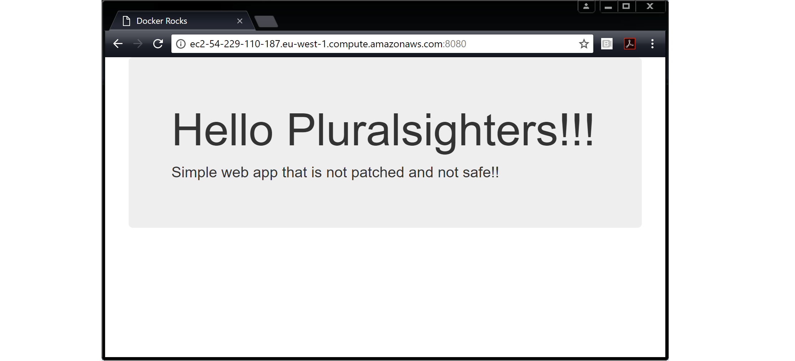

# Simple web app for Pluralsight courses and Docker Deep Dive book
This is a quick and dirty node.js app cobbled together for the purposes of demonstrating how to Dockerize/containerize a simple app.

**This app is not maintained and WILL be full of vulnerbilities. Use at own risk**

Exposes web server on port 8080 as per ./app.js

See **Dockerfile** for more details

------------------------------------------------------------------------------

Use the docker image build command to create a new image using the instructions in the Dockerfile. This example creates a new Docker image called test:latest.

```bash
docker image build -t test:latest .
```

check to make sure that the new test:latest image exists on your host.

```bash
docker image ls
```

Run a container from the image and test the app.

```bash
docker container run -d --name web1 --publish 8080:8080 test:latest
```

Open a web browser and navigate to the DNS name or IP address of the Docker host that you are running the container from, and point it to port 8080. You will see the following web page.

